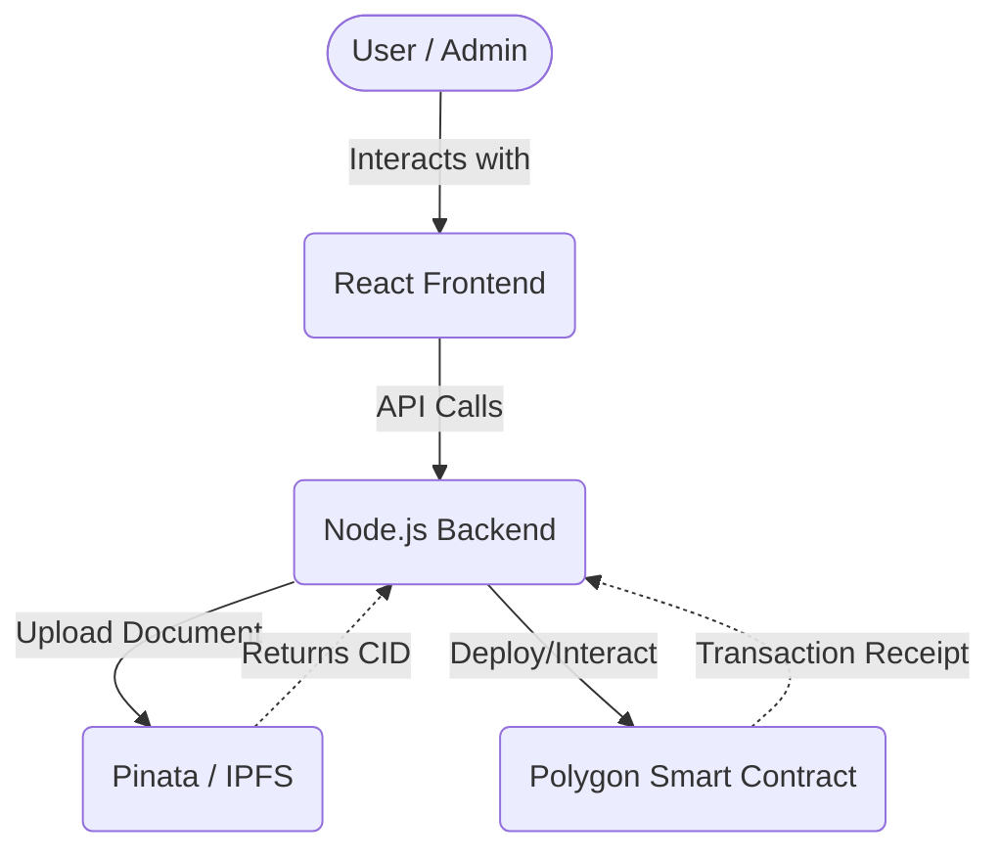
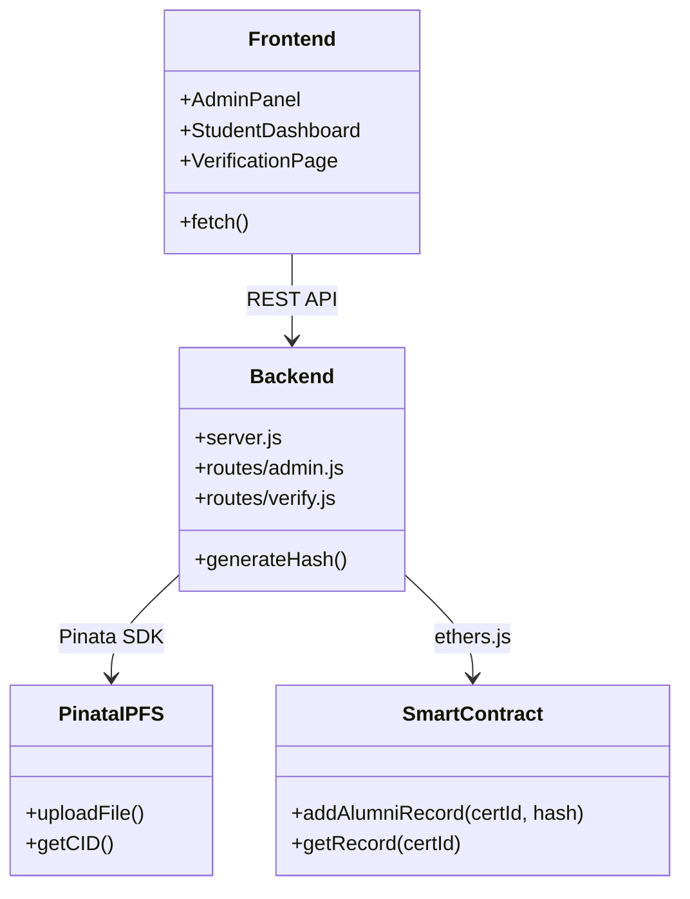
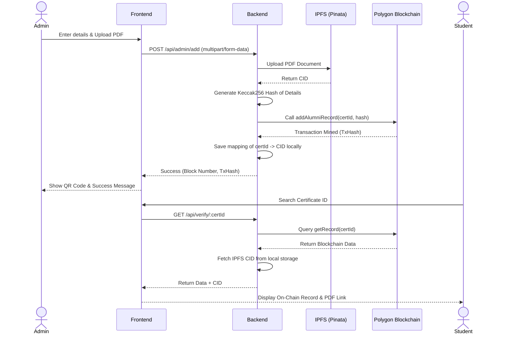

# 📚 AlmaPort - Alumni Verification System

## 🎯 Project Overview
AlmaPort is a blockchain-based alumni credential verification portal that combines a **React Frontend**, a **Node.js Backend**, and **Solidity Smart Contracts** deployed on the Polygon blockchain, seamlessly integrated with **IPFS (via Pinata)** for decentralized file storage.

The system issues tamper-proof, immutable educational credentials. The text details are securely hashed on the blockchain, while any supplementary documents (like physical certificates or marksheets in PDF format) are uploaded directly to IPFS to guarantee decentralized permanence.

---

## 🏗️ Architecture

The system follows a three-tier architecture augmented by decentralized storage:



1. **Frontend (React + Vite)**: 
   - Provides user interfaces for Admins (issuing certificates) and Students/Public (verifying certificates).
   - Handles client-side validation and responsive UI rendering.
2. **Backend (Node.js + Express)**:
   - Manages authentication (Google OAuth/JWT).
   - Handles IPFS uploads (using Multer and Pinata APIs).
   - Generates deterministic data hashes.
   - Signs and broadcasts transactions to the Polygon blockchain using `ethers.js`.
3. **Decentralized Storage (IPFS/Pinata)**:
   - Securely stores PDF documents, returning a unique Content Identifier (CID).
4. **Blockchain (Polygon Smart Contract)**:
   - Stores the generated data hash, certificate ID, issuer address, and issuance timestamp.
   - Guarantees immutability and publicly verifies data integrity.

---

## 🧩 UML Diagram

The following class diagram illustrates the major components and their interactions:



---

## 📊 Activity Diagram



---

## 🔄 Workflow

### 1. Issuing a Certificate (Admin)
- The admin logs into the portal and fills out the student's details (Name, Roll Number, Branch, etc.).
- The admin attaches an optional Extra Document (PDF).
- Upon submission, the backend uploads the PDF to IPFS via Pinata and receives a unique `CID`.
- The backend generates a strict `keccak256` hash of the student's text details.
- The hash and the unique `certId` are sent to the Polygon Smart Contract.
- The transaction is minted on the blockchain, making the record permanent.
- The `CID` is stored locally in `issued.json` to be retrieved during verification.

### 2. Verifying a Certificate (Public/Student)
- A user enters a `certId` on the Student Dashboard.
- The backend queries the Polygon blockchain to fetch the issuer and timestamp details for that `certId`.
- The backend appends the IPFS `CID` (if it exists) to the response.
- The user is presented with the blockchain verification details and a button to view the original PDF document directly from the IPFS gateway.

---

## 💻 Important Functional Code

### 1. Backend Data Hashing (`hashUtils.js`)
The backend generates a strict `keccak256` hash of the student's details before sending it to the blockchain:
```javascript
function generateDataHash({ name, rollNumber, degree, branch, graduationYear }) {
  const normName = name.trim().toLowerCase();
  const normRoll = rollNumber.trim().toLowerCase();
  const normDegree = degree.trim().toLowerCase();
  const normBranch = branch.trim().toLowerCase();
  const yearAsString = String(graduationYear).trim();

  return ethers.utils.solidityKeccak256(
    ["string", "string", "string", "string", "string"],
    [normName, normRoll, normDegree, normBranch, yearAsString]
  );
}
```

### 2. Smart Contract Record Addition (`AlumniVerification.sol`)
The Polygon smart contract stores the certificate record and ensures it cannot be altered:
```solidity
function addAlumniRecord(string memory _certId, bytes32 _dataHash)
    external
    onlyAuthorizedIssuer
    certIdNotExists(_certId)
    returns (bool success, uint256 timestamp, uint256 blockNumber)
{
    AlumniRecord memory newRecord = AlumniRecord({
        certId: _certId,
        dataHash: _dataHash,
        issuer: msg.sender,
        timestamp: block.timestamp,
        blockNumber: block.number,
        exists: true,
        issuerName: issuerNames[msg.sender]
    });

    records[_certId] = newRecord;
    certificateIds.push(_certId);
    totalRecords++;

    emit AlumniRecordAdded(_certId, _dataHash, msg.sender, issuerNames[msg.sender], block.timestamp, block.number);

    return (true, block.timestamp, block.number);
}
```

---

## 📸 Results Image


> *Note: This is a placeholder. Replace `./assets/verification_result_placeholder.png` with the actual screenshot path of the successful verification screen once captured.*

---

## 📖 Short User Manual

### For Administrators
1. **Login**: Use your authorized Google Workspace email to log into the Admin portal.
2. **Issue Certificate**: Navigate to "Add Alumni Record". Fill out all required student details exactly as they appear on the physical record.
3. **Upload PDF**: Click "Choose File" under Extra Document to upload the student's PDF marksheet or passing certificate.
4. **Submit**: Click "Submit to Blockchain". Wait for the transaction to complete. You will be provided with a shareable Verification QR Code.

### For Students / Employers
1. **Dashboard Access**: Access the Student Dashboard from the main homepage.
2. **Lookup**: Enter the unique Certificate ID provided by the university.
3. **Inspect**: Review the "On-Chain Record". If the details match the blockchain hash, a green "Verified" badge will appear.
4. **View Document**: If the university uploaded a supporting PDF, click the **"View Attached PDF"** button to view the original document on IPFS.
5. **Verify Data**: Use the "Verify My Data" panel to manually type in your details to mathematically prove they hash to the same value stored on the blockchain.

---

## ⚠️ Guidelines

### Best Practices
- **Case Sensitivity**: The data hashing is strictly case-sensitive. "B.Tech" and "b.tech" will result in entirely different hashes. Admins must follow a strict data entry convention.
- **PDF Size**: Ensure uploaded PDFs are optimized in size (preferably under 5MB) to ensure fast IPFS uploads and retrieval.
- **Environment Variables**: Never commit `.env` or `config.local.json` to source control. Ensure your `PINATA_JWT` and Polygon `PRIVATE_KEY` are kept completely secure.

### Network Configuration
- The project currently runs on the **Polygon Amoy Testnet**.
- Ensure the backend wallet has sufficient testnet MATIC to cover transaction gas fees.
- If migrating to Mainnet, update the `RPC_URL` and `CONTRACT_ADDRESS` in the backend configuration.
